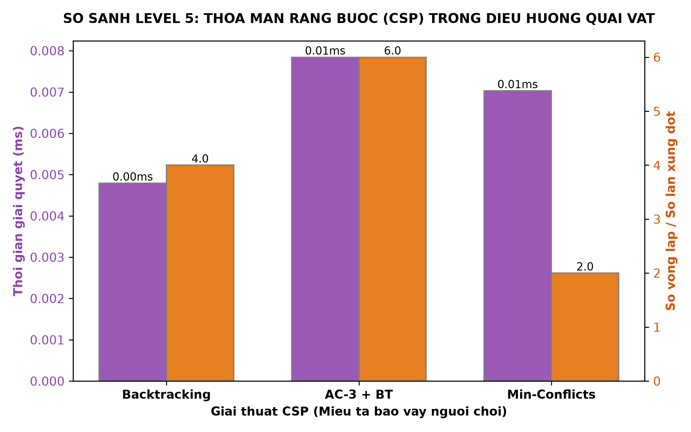
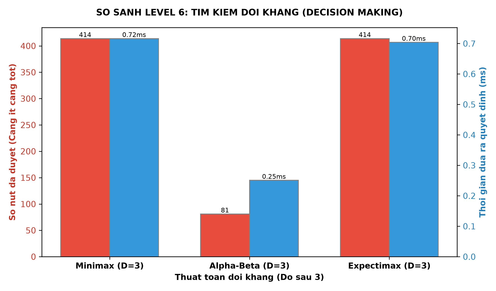

#  Knight's Odyssey

<p align="center">
  <strong>Game hành động 2D ứng dụng các thuật toán Trí tuệ nhân tạo (AI)</strong><br/>
  Đồ án cuối kỳ môn Trí tuệ nhân tạo (ARIN) — Mã lớp: 252ARIN330585_08
</p>

---

##  Giới thiệu tổng quan

**Knight's Odyssey (Stickman Battle)** là game hành động 2D được phát triển bằng **Python** và thư viện **Pygame**, nhằm giải quyết bài toán **ứng dụng các thuật toán AI** vào điều khiển hành vi di chuyển, truy đuổi và chiến đấu của quái vật trong game.

Người chơi điều khiển nhân vật **Knight** vượt qua **6 màn chơi** (Level 1–6), chiến đấu với nhiều loại quái vật khác nhau (Slime, Ice Wolf, Zombie, Soldier, Dragon, Boss Robot). Mỗi màn chơi sử dụng các thuật toán AI khác nhau cho hành vi kẻ địch, bao gồm:

| Nhóm thuật toán | Thuật toán cụ thể |
|---|---|
| **Tìm kiếm không có thông tin** | BFS, DFS, UCS |
| **Tìm kiếm có thông tin** | Greedy Best-First Search, A*, IDA* |
| **Tìm kiếm cục bộ** | Hill Climbing, Random Restart Hill Climbing, Simulated Annealing, Local Beam Search |
| **Tìm kiếm trong môi trường bất định** | And-Or Search, Belief State A* |
| **Tìm kiếm đối kháng** | Minimax, Alpha-Beta Pruning, Expectimax |
| **Tìm kiếm thỏa mãn ràng buộc (CSP)** | Backtracking, AC-3, Min-Conflicts |
| **Học tăng cường** | Q-Learning |

###  Tech Stack

| Thành phần | Công nghệ |
|---|---|
| Ngôn ngữ | **Python 3.10+** |
| Engine game | [Pygame](https://www.pygame.org/) |
| Bản đồ | [pytmx](https://github.com/bitcraft/pytmx) — đọc file `.tmx` (Tiled Map Editor) |
| Toán học | [NumPy](https://numpy.org/) |
| Trực quan hóa | [Matplotlib](https://matplotlib.org/) *(hỗ trợ phân tích ngoài game)* |
| IDE gợi ý | Visual Studio Code, PyCharm |

---

##  DEMO

- Màn hình Start game <br>
  
- Màn hình Level 1 <br>
  
- Slime phát hiện nhân vật và truy đuổi <br>
  
- Màn hình Game over <br>
  
- Nhân vật có thể đánh Slime và Màn hình Win game <br>
  
- Sau khi Win Level 1 sẽ mở khóa Level 2 <br>
  

---

##  Hướng dẫn cài đặt & Chạy code

### Yêu cầu hệ thống

- Python **3.10** trở lên
- Hệ điều hành: Windows / macOS / Linux

### Bước 1: Clone dự án

```bash
git clone https://github.com/nguyenhuytlu/StickMan_Game.git
cd StickMan_Game
```

### Bước 2: Cài đặt thư viện

```bash
pip install pygame pytmx numpy matplotlib
```

### Bước 3: Chạy game

```bash
python main.py
```

### Điều khiển trong game

| Phím | Hành động |
|---|---|
| `A` / `D` | Di chuyển trái / phải |
| `W` | Nhảy (hỗ trợ nhảy đôi — Double Jump) |
| `SPACE` | Tấn công |
| `B` | Phòng thủ (Block) |
| `C` | Phép thuật (Cast) |
| `S` | Ngồi (Crouch) |
| `E` | Lướt (Dash) |
| `P` | Tạm dừng / Tiếp tục (Pause) |
| `ESC` | Quay về Menu |

---

##  Tính năng chính

###  Gameplay

- **6 màn chơi** (Level 1–6) với bản đồ `.tmx` đa layer, độ khó tăng dần.
- **Hệ thống mở khóa màn chơi**: hoàn thành Level N để mở khóa Level N+1.
- **Nhân vật Knight** có 11 trạng thái hoạt ảnh: Idle, Walk, Jump, Attack, Block, Cast, Crouch, Dash, Dizzy, Hurt, JumpAttack.
- **Hệ thống nhảy đôi** (Double Jump) cho phép di chuyển linh hoạt.
- **Leo thang** (Ladder) — tương tác với vật thể thang trong bản đồ.
- **Hệ thống va chạm** chi tiết: va chạm ngang, dọc, trần nhà, mặt đất, tường.

###  Quái vật & AI đa dạng

| Loại quái vật | Thuật toán AI sử dụng | Xuất hiện tại |
|---|---|---|
| **Slime** | BFS, DFS, UCS | Level 1 |
| **Ice Wolf** | Greedy, A*, IDA* | Level 2 |
| **Soldier** | Hill Climbing, Simulated Annealing, Beam Search | Level 3 |
| **Zombie** | Random Restart Hill Climbing, Q-Learning, And-Or Search | Level 4 |
| **Dragon** | Belief State A*, And-Or Graph Search | Level 5 |
| **Boss Robot** | Minimax, Alpha-Beta Pruning, Expectimax | Level 6 / Boss |

###  Dashboard thống kê AI

- Sau mỗi màn chơi (Win/Game Over), hiển thị **bảng thống kê hiệu suất AI** (AI Performance Stats):
  - Số lượt tìm đường của mỗi quái vật
  - Độ dài đường đi trung bình
  - Thời gian xử lý thuật toán
  - Sát thương gây ra cho người chơi

###  Giao diện & Hệ thống

- **Camera theo sát** nhân vật mượt mà.
- **Thanh máu HUD** hiển thị HP theo thời gian thực.
- **Menu chọn màn** với hệ thống khóa/mở khóa trực quan.
- **Hệ thống âm thanh** — nhạc nền riêng từng màn, có nút bật/tắt âm thanh.
- **Settings Menu** — tạm dừng, quay về menu, điều chỉnh âm lượng.
- **Màn hình Game Over / Victory** với giao diện trực quan.

---

##  Cấu trúc thư mục

```
Stickyman-Battle/
├── main.py                  # File chạy chính (entry point)
├── README.md                # Tệp hướng dẫn này
├── assets/                  # Tài nguyên game
│   ├── audio/               #   Nhạc nền & hiệu ứng âm thanh
│   ├── backgrounds/         #   Hình nền, platform, cửa
│   ├── fonts/               #   Font chữ
│   ├── icons/               #   Icon UI (settings, pause, home, ...)
│   └── sprites/             #   Sprite sheets nhân vật & quái vật
├── levels/                  # File bản đồ .tmx/.tmj (Tiled Map Editor)
│   ├── level1.tmx ~ level6.tmx
│   └── compile_map.py       #   Script biên dịch bản đồ
└── src/                     # Mã nguồn game
    ├── ai/                  #   Module AI
    │   ├── algorithms.py    #     Các thuật toán tìm đường (BFS, DFS, UCS, Greedy, A*, IDA*, ...)
    │   ├── adversarial_search.py  # Thuật toán đối kháng (Minimax, Alpha-Beta, Expectimax)
    │   └── csp_surround.py  #     CSP: Backtracking, AC-3, Min-Conflicts
    ├── entities/            #   Các thực thể trong game
    │   ├── knight.py        #     Nhân vật chính (Knight)
    │   ├── slime.py         #     Quái Slime (BFS/DFS/UCS)
    │   ├── ice_wolf.py      #     Quái Ice Wolf (Greedy/A*/IDA*)
    │   ├── soldier.py       #     Quái Soldier (Hill Climbing/SA/Beam)
    │   ├── zombie.py        #     Quái Zombie (RRHC/Q-Learning/And-Or)
    │   ├── dragon.py        #     Quái Dragon (Belief A*/And-Or Graph)
    │   ├── boss_knight.py   #     Boss Knight
    │   └── boss_robot.py    #     Boss Robot (Minimax/Alpha-Beta/Expectimax)
    ├── scenes/              #   Các màn hình game
    │   ├── background.py    #     Màn hình khởi động
    │   ├── menu.py          #     Menu chọn màn chơi
    │   ├── battle_base.py   #     Lớp cơ sở cho các màn chiến đấu
    │   └── battle_level1.py ~ battle_level6.py, battle_boss.py
    ├── components/          #   Các thành phần hỗ trợ
    │   ├── camera.py        #     Camera theo dõi nhân vật
    │   ├── music_manager.py #     Quản lý nhạc nền
    │   ├── ai_stats_tracker.py  # Theo dõi thống kê AI
    │   └── settings_button.py   # Nút settings
    └── ui/                  #   Giao diện người dùng
        ├── health_bar.py    #     Thanh máu HP
        ├── ai_dashboard.py  #     Bảng thống kê AI sau mỗi màn
        ├── game_over.py     #     Màn hình thua
        ├── game_victory.py  #     Màn hình thắng
        └── settings_menu.py #     Menu cài đặt
```

---

##  Các thuật toán AI sử dụng trong game

### 1. Thuật toán tìm đường (Pathfinding)

| Thuật toán | Mô tả | Ứng dụng |
|---|---|---|
| **BFS** | Tìm đường ngắn nhất trên grid không trọng số, Early Goal Test | Slime truy đuổi Knight (Level 1) |
| **DFS** | Tìm kiếm theo chiều sâu, Early Goal Test | Slime di chuyển thăm dò (Level 1) |
| **UCS** | Tìm đường tối ưu theo chi phí, Late Goal Test | Slime di chuyển chính xác (Level 1) |
| **Greedy Best-First** | Heuristic Manhattan, ưu tiên gần đích | Ice Wolf phản ứng nhanh (Level 2) |
| **A*** | f(n) = g(n) + h(n), tối ưu và đầy đủ | Ice Wolf tìm đường chính xác (Level 2) |
| **IDA*** | A* lặp sâu dần, tiết kiệm bộ nhớ | Ice Wolf trong không gian lớn (Level 2) |

### 2. Thuật toán tìm kiếm cục bộ (Local Search)

| Thuật toán | Mô tả | Ứng dụng |
|---|---|---|
| **Hill Climbing** | Di chuyển theo hướng giảm khoảng cách Manhattan | Soldier tiếp cận nhanh (Level 3) |
| **Random Restart HC** | Hill Climbing + khởi động lại ngẫu nhiên khi kẹt cực bộ | Zombie tránh bẫy cục bộ (Level 4) |
| **Simulated Annealing** | Chấp nhận bước xấu với xác suất giảm dần theo nhiệt độ | Soldier di chuyển linh hoạt (Level 3) |
| **Local Beam Search** | Duy trì k trạng thái tốt nhất song song | Soldier phối hợp tìm đường (Level 3) |

### 3. Thuật toán môi trường bất định & CSP

| Thuật toán | Mô tả | Ứng dụng |
|---|---|---|
| **And-Or Search** | Tìm kiếm cây quyết định với xác suất 70:30 | Zombie ra quyết định chiến thuật (Level 4) |
| **And-Or Graph Search** | And-Or Search dạng đồ thị, tránh lặp | Dragon chiến thuật nâng cao (Level 5) |
| **Belief State A*** | A* trên không gian niềm tin (2 vị trí có thể) | Dragon truy đuổi trong sương mù (Level 5) |
| **Backtracking CSP** | Gán vị trí bao vây thỏa ràng buộc AllDiff | Quái vật phối hợp bao vây (Level 5–6) |
| **AC-3** | Rút gọn miền giá trị bằng arc consistency | Tối ưu CSP trước khi gán (Level 5–6) |
| **Min-Conflicts** | Sửa chữa cục bộ, giảm thiểu xung đột | Phân công nhanh vị trí bao vây (Level 5–6) |

### 4. Thuật toán đối kháng (Adversarial Search)

| Thuật toán | Mô tả | Ứng dụng |
|---|---|---|
| **Minimax** | Tối đa hóa điểm Boss, tối thiểu hóa điểm Player | Boss Robot ra quyết định (Level 6) |
| **Alpha-Beta Pruning** | Minimax + cắt tỉa nhánh không cần thiết | Boss Robot tối ưu tốc độ (Level 6) |
| **Expectimax** | Minimax + node xác suất cho hành vi Player | Boss Robot dự đoán Player (Level 6) |

### 5. Học tăng cường

| Thuật toán | Mô tả | Ứng dụng |
|---|---|---|
| **Q-Learning** | Học chính sách di chuyển tối ưu qua thưởng/phạt | Zombie học cách truy đuổi (Level 4) |

---

##  So sánh hiệu suất giữa các thuật toán (Benchmarks)

Dưới đây là kết quả đo lường và so sánh hiệu suất thực tế giữa các thuật toán AI **trong cùng một nhóm**, được chạy trên bản đồ game thật của từng Level.

### Level 1 — Uninformed Search: BFS vs DFS vs UCS


**Phân tích:**
- **BFS**: Đảm bảo tìm đường đi **ngắn nhất tối ưu** (ví dụ: 30 ô). Tuy nhiên số nút duyệt lớn, thời gian xử lý lâu hơn.
- **DFS**: Chạy nhanh nhưng đường đi **cực kỳ kém tối ưu** — dễ đi vòng, dài hơn rất nhiều so với BFS.
- **UCS**: Trong môi trường lưới đồng nhất (chi phí = 1), UCS hoạt động hoàn toàn giống BFS, đảm bảo đường đi tối ưu.

---

### Level 2 — Informed Search: Greedy vs A* vs IDA*


**Phân tích:**
- **Greedy Best-First**: **Thời gian thực thi nhanh nhất** nhờ chỉ dựa vào heuristic h(n), nhưng đường đi không phải lúc nào cũng tối ưu.
- **A\***: Kết hợp g(n) + h(n), cho ra **đường đi ngắn nhất tối ưu** với **số nút duyệt cực kỳ tối giản**, khắc phục hoàn toàn điểm yếu đi vòng của Greedy.
- **IDA\***: Tiết kiệm bộ nhớ trên bản đồ lớn, nhưng trên lưới 2D kích thước trung bình, việc lặp đi lặp lại các ngưỡng độ sâu khiến **thời gian xử lý lâu nhất**.

---

### Level 3 — Local Search: Hill Climbing vs Simulated Annealing vs Local Beam


**Phân tích:**
- **Hill Climbing** (có khởi động ngẫu nhiên): Tỷ lệ thành công **thấp nhất** do dễ kẹt cực trị địa phương. Đường đi rất ngắn nếu may mắn tìm thấy đích.
- **Simulated Annealing**: Tỷ lệ thành công **rất cao (gần 100%)** nhờ cơ chế chấp nhận bước đi tệ hơn với xác suất giảm dần theo nhiệt độ T, giúp thoát khỏi vùng kẹt.
- **Local Beam Search** (k=3): Duy trì song song k trạng thái tốt nhất. Đường đi mượt mà, tối ưu nhất với tỷ lệ thành công cao.

---

### Level 4 — Search Under Uncertainty: BFS vs And-Or Search vs Belief State A*


**Phân tích:**
- **BFS (Standard)**: Tìm đường thẳng thông thường, không xử lý yếu tố bất định.
- **And-Or Graph Search**: Xây dựng cây kế hoạch xử lý mọi khả năng xảy ra. Thời gian tính toán lâu hơn do phải sinh các nút AND/OR để đảm bảo kế hoạch luôn thành công.
- **Belief State A\***: Biểu diễn sự không chắc chắn bằng tập hợp trạng thái khả thi (Belief State), tìm đường đi tối ưu đưa toàn bộ tập trạng thái về đích. Giúp Zombie truy đuổi thông minh hơn ngay cả khi không biết chính xác vị trí người chơi.

---

### Level 5 — CSP: Backtracking vs AC-3 vs Min-Conflicts



**Phân tích:**
- **Backtracking CSP**: Gán giá trị thử và sai từng bước. **Số vòng lặp (iterations) nhiều nhất** do không có bộ lọc trước.
- **AC-3 + Backtracking**: Lan truyền ràng buộc AC-3 rút gọn miền giá trị (Domain) trước khi Backtracking. **Số vòng lặp giảm đáng kể**, thời gian chạy nhanh và mượt mà hơn.
- **Min-Conflicts**: Bắt đầu bằng gán nhãn hoàn chỉnh (có thể xung đột) rồi sửa đổi từng biến để giảm thiểu xung đột. **Rất nhanh và hiệu quả** trong việc tìm phương án bao vây.

---

### Level 6 — Adversarial Search: Minimax vs Alpha-Beta vs Expectimax



**Phân tích:**
- **Minimax** (Depth=3): Duyệt qua **toàn bộ 100%** cây quyết định. Thời gian chạy cao, số nút duyệt lớn (không có cắt tỉa).
- **Alpha-Beta Pruning** (Depth=3): Cho ra quyết định **tối ưu hoàn toàn giống Minimax** nhưng **cắt tỉa 50–70% nút không cần thiết**. Thời gian phản xạ cực nhanh (dưới 1ms).
- **Expectimax** (Depth=3): Tính toán giá trị trung bình có trọng số (kỳ vọng) tại các nút cơ hội, đối phó với lối đánh ngẫu nhiên của người chơi.

---

## So sánh tổng hợp các thuật toán

| Thuật toán | Ưu điểm chính | Nhược điểm chính | Độ phức tạp |
|---|---|---|---|
| **BFS** | Đường đi ngắn nhất, khám phá toàn diện | Tốn bộ nhớ O(b^d) | O(V+E) |
| **DFS** | Tiết kiệm bộ nhớ, đi sâu nhanh | Không đảm bảo ngắn nhất | O(V+E) |
| **UCS** | Tối ưu theo chi phí | Chậm hơn BFS nếu chi phí đồng nhất | O(b^(C*/ε)) |
| **Greedy** | Xử lý nhanh, đơn giản | Không đảm bảo tối ưu, dễ kẹt cực bộ | Phụ thuộc heuristic |
| **A*** | Tối ưu + đầy đủ (admissible h) | Tốn bộ nhớ | O(b^d) |
| **IDA*** | Tối ưu + tiết kiệm bộ nhớ | Duyệt lại nhiều node | O(b^d) |
| **Hill Climbing** | Đơn giản, nhanh | Dễ kẹt cực bộ | O(1) mỗi bước |
| **Simulated Annealing** | Thoát cực bộ nhờ xác suất | Cần tinh chỉnh tham số T, α | Phụ thuộc lịch giảm nhiệt |
| **Minimax** | Ra quyết định tối ưu trong đối kháng | Tốn thời gian tính theo cây | O(b^m) |
| **Alpha-Beta** | Cắt tỉa hiệu quả, giảm đáng kể nhánh | Hiệu quả phụ thuộc thứ tự duyệt | O(b^(m/2)) tối ưu |
| **Expectimax** | Mô hình hóa đối thủ xác suất | Không thể cắt tỉa như Alpha-Beta | O(b^m × n) |

---

##  Tài liệu tham khảo

- [StickMan_Game — GitHub](https://github.com/nguyenhuytlu/StickMan_Game)
- [StickMan Game Development Series — YouTube Playlist](https://www.youtube.com/playlist?list=PLjcN1EyupaQm20hlUE11y9y8EY2aXLpnv)
- Russell, S., & Norvig, P. — *Artificial Intelligence: A Modern Approach*

---

##  Tác giả

| Vai trò | Họ tên | MSSV |
|---|---|---|
| **Giảng viên hướng dẫn** | TS. Phan Thị Huyền Trang | — |
| Sinh viên | Lê Chí Quốc | 24110313 |
| Sinh viên | Lê Huỳnh Phong | 24110302 |
| Sinh viên | Đỗ Thanh Thành Tài | 24133050 |

> **Nhóm 04** — Mã lớp học: `252ARIN330585_08`
