#  Knight's Odyssey

<p align="center">
  <strong>Game hành động 2D ứng dụng các thuật toán Trí tuệ nhân tạo (AI)</strong><br/>
  Đồ án cuối kỳ môn Trí tuệ nhân tạo (ARIN) — Mã lớp: 252ARIN330585_08
</p>

---

##  Giới thiệu tổng quan

**Knight's Odyssey (Stickman Battle)** là game hành động 2D được phát triển bằng **Python** và thư viện **Pygame**, nhằm giải quyết bài toán **ứng dụng các thuật toán AI** vào điều khiển hành vi di chuyển, truy đuổi và chiến đấu của quái vật trong game.

Người chơi điều khiển nhân vật **Knight** vượt qua **6 màn chơi** (Level 1–6), chiến đấu với nhiều loại quái vật khác nhau (Slime, Ice Wolf, Zombie, Soldier, Dragon, Boss Robot). Mỗi màn chơi sử dụng các thuật toán AI khác nhau cho hành vi kẻ địch, bao gồm:

| Nhóm thuật toán | Thuật toán cụ thể |
|---|---|
| **Tìm kiếm không có thông tin** | BFS, DFS, UCS |
| **Tìm kiếm có thông tin** | Greedy Best-First Search, A*, IDA* |
| **Tìm kiếm cục bộ** | Hill Climbing, Simulated Annealing, Local Beam Search |
| **Tìm kiếm trong môi trường bất định** | And-Or Graph Search, Belief State, Belief State & Goal |
| **Tìm kiếm đối kháng** | Minimax, Alpha-Beta Pruning, Expectimax |
| **Tìm kiếm thỏa mãn ràng buộc (CSP)** | Backtracking, AC-3, Min-Conflicts |

###  Tech Stack

| Thành phần | Công nghệ |
|---|---|
| Ngôn ngữ | **Python 3.10+** |
| Engine game | [Pygame](https://www.pygame.org/) |
| Bản đồ | [pytmx](https://github.com/bitcraft/pytmx) — đọc file `.tmx` (Tiled Map Editor) |
| Toán học | [NumPy](https://numpy.org/) |
| Trực quan hóa | [Matplotlib](https://matplotlib.org/) *(hỗ trợ phân tích ngoài game)* |
| IDE gợi ý | Visual Studio Code, PyCharm |

---

##  DEMO

- **Màn hình Start game** <br>
  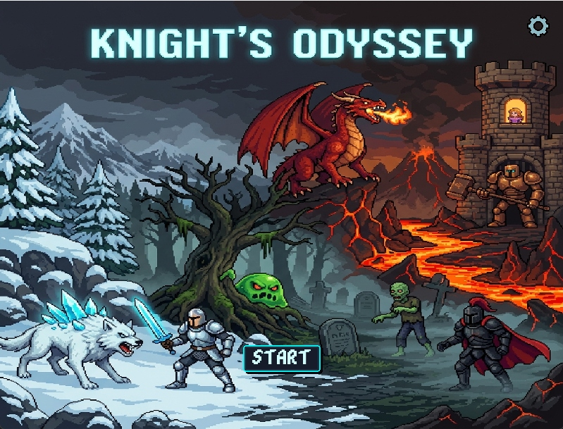
- **Màn hình World Map (Chọn màn chơi)** <br>
  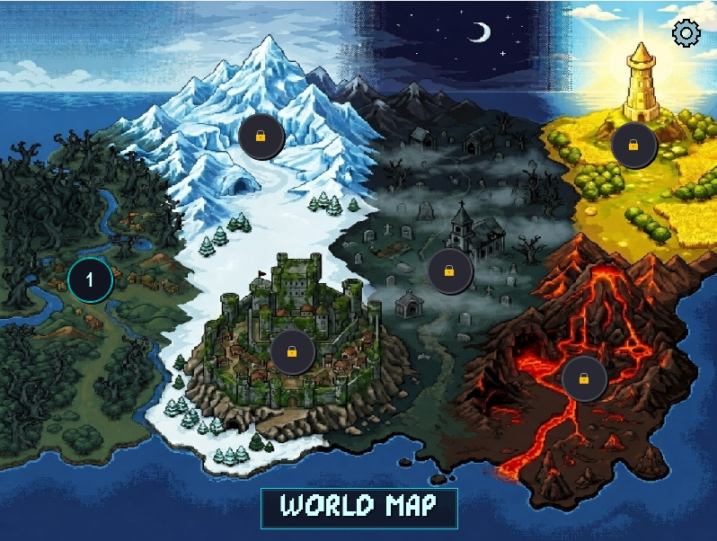
- **Màn hình gameplay Level 1 với các Slime (được gán các thuật toán UCS, BFS, DFS)** <br>
  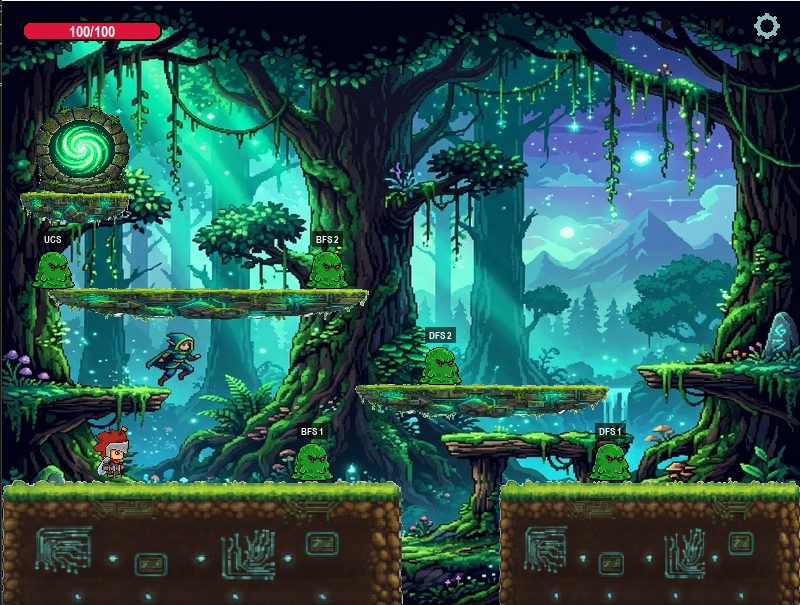
- **Bảng thống kê hiệu năng AI (AI Performance Stats) sau khi kết thúc Level 1** <br>
  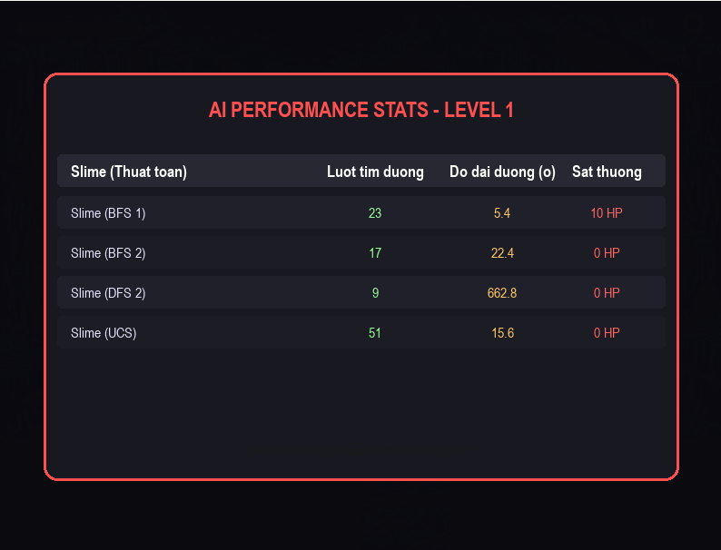
- **Màn hình Game over** <br>
  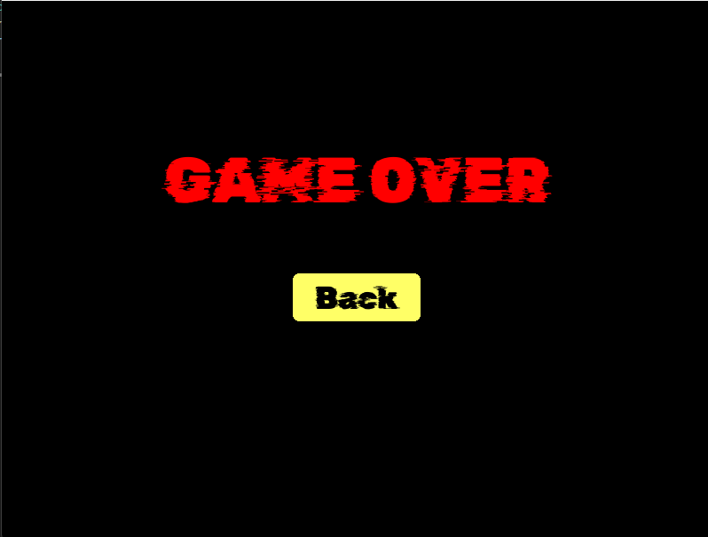
- **Màn hình chiến thắng (You Win)** <br>
  
- **Sau khi thắng Level 1 sẽ mở khóa sang Level 2 trên World Map** <br>
  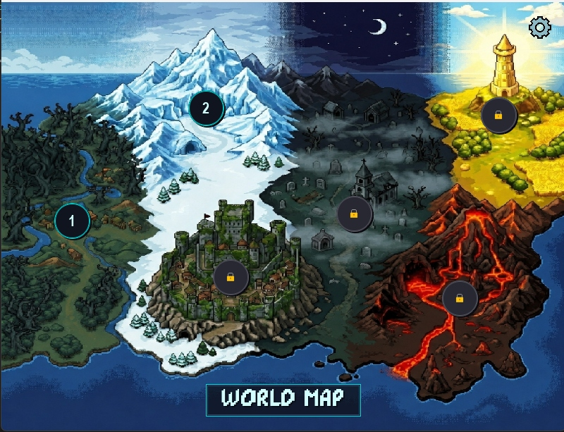


---

##  Hướng dẫn cài đặt & Chạy code

### Yêu cầu hệ thống

- Python **3.10** trở lên
- Hệ điều hành: Windows / macOS / Linux

### Bước 1: Clone dự án

```bash
git clone https://github.com/thnhtaii/KNIGHT-S-ODYSSEY.git
cd KNIGHT-S-ODYSSEY
```

### Bước 2: Cài đặt thư viện

```bash
pip install pygame pytmx numpy matplotlib
```

### Bước 3: Chạy game

```bash
python main.py
```

### Điều khiển trong game

| Phím | Hành động |
|---|---|
| `A` / `D` | Di chuyển trái / phải |
| `W` | Nhảy (hỗ trợ nhảy đôi — Double Jump) |
| `SPACE` | Tấn công |
| `B` | Phòng thủ (Block) |
| `C` | Phép thuật (Cast) |
| `S` | Ngồi (Crouch) |
| `E` | Lướt (Dash) |
| `P` | Tạm dừng / Tiếp tục (Pause) |
| `ESC` | Quay về Menu |

---

##  Tính năng chính

###  Gameplay

- **6 màn chơi** (Level 1–6) với bản đồ `.tmx` đa layer, độ khó tăng dần.
- **Hệ thống mở khóa màn chơi**: hoàn thành Level N để mở khóa Level N+1.
- **Nhân vật Knight** có 11 trạng thái hoạt ảnh: Idle, Walk, Jump, Attack, Block, Cast, Crouch, Dash, Dizzy, Hurt, JumpAttack.
- **Hệ thống nhảy đôi** (Double Jump) cho phép di chuyển linh hoạt.
- **Leo thang** (Ladder) — tương tác với vật thể thang trong bản đồ.
- **Hệ thống va chạm** chi tiết: va chạm ngang, dọc, trần nhà, mặt đất, tường.

###  Quái vật & AI đa dạng

| Loại quái vật | Thuật toán AI sử dụng | Xuất hiện tại |
|---|---|---|
| **Slime** | BFS, DFS, UCS | Level 1 |
| **Ice Wolf** | Greedy, A*, IDA* | Level 2 |
| **Soldier** | Hill Climbing, Simulated Annealing, Beam Search | Level 3 |
| **Zombie** | And-Or Graph Search, Belief State, Belief State & Goal | Level 4 |
| **Dragon** | Backtracking CSP, AC-3, Min-Conflicts CSP | Level 5 |
| **Boss Robot** | Minimax, Alpha-Beta Pruning, Expectimax | Level 6 / Boss |

###  Dashboard thống kê AI

- Sau mỗi màn chơi (Win/Game Over), hiển thị **bảng thống kê hiệu suất AI** (AI Performance Stats):
  - Số lượt tìm đường của mỗi quái vật
  - Độ dài đường đi trung bình
  - Thời gian xử lý thuật toán
  - Sát thương gây ra cho người chơi

###  Giao diện & Hệ thống

- **Camera theo sát** nhân vật mượt mà.
- **Thanh máu HUD** hiển thị HP theo thời gian thực.
- **Menu chọn màn** với hệ thống khóa/mở khóa trực quan.
- **Hệ thống âm thanh** — nhạc nền riêng từng màn, có nút bật/tắt âm thanh.
- **Settings Menu** — tạm dừng, quay về menu, điều chỉnh âm lượng.
- **Màn hình Game Over / Victory** với giao diện trực quan.

---

##  Cấu trúc thư mục

```
Knights-Odyssey/
├── main.py                  # File chạy chính (entry point)
├── README.md                # Tệp hướng dẫn này
├── assets/                  # Tài nguyên game
│   ├── audio/               #   Nhạc nền & hiệu ứng âm thanh
│   ├── backgrounds/         #   Hình nền, platform, cửa
│   ├── fonts/               #   Font chữ
│   ├── icons/               #   Icon UI (settings, pause, home, ...)
│   └── sprites/             #   Sprite sheets nhân vật & quái vật
├── levels/                  # File bản đồ .tmx/.tmj (Tiled Map Editor)
│   ├── level1.tmx ~ level6.tmx
│   └── compile_map.py       #   Script biên dịch bản đồ
└── src/                     # Mã nguồn game
    ├── ai/                  #   Module AI
    │   ├── algorithms.py    #     Các thuật toán tìm đường (BFS, DFS, UCS, Greedy, A*, IDA*, ...)
    │   ├── adversarial_search.py  # Thuật toán đối kháng (Minimax, Alpha-Beta, Expectimax)
    │   └── csp_surround.py  #     CSP: Backtracking, AC-3, Min-Conflicts
    ├── entities/            #   Các thực thể trong game
    │   ├── knight.py        #     Nhân vật chính (Knight)
    │   ├── slime.py         #     Quái Slime (BFS/DFS/UCS)
    │   ├── ice_wolf.py      #     Quái Ice Wolf (Greedy/A*/IDA*)
    │   ├── soldier.py       #     Quái Soldier (Hill Climbing/SA/Beam)
    │   ├── zombie.py        #     Quái Zombie (RRHC/Q-Learning/And-Or)
    │   ├── dragon.py        #     Quái Dragon (Belief A*/And-Or Graph)
    │   ├── boss_knight.py   #     Boss Knight
    │   └── boss_robot.py    #     Boss Robot (Minimax/Alpha-Beta/Expectimax)
    ├── scenes/              #   Các màn hình game
    │   ├── background.py    #     Màn hình khởi động
    │   ├── menu.py          #     Menu chọn màn chơi
    │   ├── battle_base.py   #     Lớp cơ sở cho các màn chiến đấu
    │   └── battle_level1.py ~ battle_level6.py, battle_boss.py
    ├── components/          #   Các thành phần hỗ trợ
    │   ├── camera.py        #     Camera theo dõi nhân vật
    │   ├── music_manager.py #     Quản lý nhạc nền
    │   ├── ai_stats_tracker.py  # Theo dõi thống kê AI
    │   └── settings_button.py   # Nút settings
    └── ui/                  #   Giao diện người dùng
        ├── health_bar.py    #     Thanh máu HP
        ├── ai_dashboard.py  #     Bảng thống kê AI sau mỗi màn
        ├── game_over.py     #     Màn hình thua
        ├── game_victory.py  #     Màn hình thắng
        └── settings_menu.py #     Menu cài đặt
```

---

##  Các thuật toán AI sử dụng trong game

### 1. Thuật toán tìm đường (Pathfinding)

| Thuật toán | Mô tả | Ứng dụng |
|---|---|---|
| **BFS** | Tìm đường ngắn nhất trên grid không trọng số, Early Goal Test | Slime truy đuổi Knight (Level 1) |
| **DFS** | Tìm kiếm theo chiều sâu, Early Goal Test | Slime di chuyển thăm dò (Level 1) |
| **UCS** | Tìm đường tối ưu theo chi phí, Late Goal Test | Slime di chuyển chính xác (Level 1) |
| **Greedy Best-First** | Heuristic Manhattan, ưu tiên gần đích | Ice Wolf phản ứng nhanh (Level 2) |
| **A*** | f(n) = g(n) + h(n), tối ưu và đầy đủ | Ice Wolf tìm đường chính xác (Level 2) |
| **IDA*** | A* lặp sâu dần, tiết kiệm bộ nhớ | Ice Wolf trong không gian lớn (Level 2) |

### 2. Thuật toán tìm kiếm cục bộ (Local Search)

| Thuật toán | Mô tả | Ứng dụng |
|---|---|---|
| **Hill Climbing** | Di chuyển theo hướng giảm khoảng cách Manhattan | Soldier tiếp cận nhanh (Level 3) |
| **Simulated Annealing** | Chấp nhận bước xấu với xác suất giảm dần theo nhiệt độ | Soldier di chuyển linh hoạt (Level 3) |
| **Local Beam Search** | Duy trì k trạng thái tốt nhất song song | Soldier phối hợp tìm đường (Level 3) |

### 3. Thuật toán môi trường bất định (Uncertainty Search)

| Thuật toán | Mô tả | Ứng dụng |
|---|---|---|
| **And-Or Graph Search** | Tìm kiếm cây quyết định với kết quả hành động bất định | Zombie ra quyết định chiến thuật (Level 4) |
| **Belief State** | Tập hợp trạng thái khả thi khi thiếu thông tin | Zombie định vị người chơi trong sương mù (Level 4) |
| **Belief Goal Search** | Đưa toàn bộ tập trạng thái tin tưởng về đích | Zombie truy đuổi người chơi (Level 4) |

### 4. Thuật toán thỏa mãn ràng buộc (CSP)

| Thuật toán | Mô tả | Ứng dụng |
|---|---|---|
| **Backtracking CSP** | Gán vị trí bao vây thỏa ràng buộc AllDiff | Dragon phối hợp bao vây (Level 5) |
| **AC-3** | Rút gọn miền giá trị bằng arc consistency | Tối ưu CSP trước khi gán (Level 5) |
| **Min-Conflicts** | Sửa chữa cục bộ, giảm thiểu xung đột | Phân công nhanh vị trí bao vây (Level 5) |

### 5. Thuật toán đối kháng (Adversarial Search)

| Thuật toán | Mô tả | Ứng dụng |
|---|---|---|
| **Minimax** | Tối đa hóa điểm Boss, tối thiểu hóa điểm Player | Boss Robot ra quyết định (Level 6) |
| **Alpha-Beta Pruning** | Minimax + cắt tỉa nhánh không cần thiết | Boss Robot tối ưu tốc độ (Level 6) |
| **Expectimax** | Minimax + node xác suất cho hành vi Player | Boss Robot dự đoán Player (Level 6) |

---

##  Đánh giá hiệu suất thuật toán AI theo từng Level

Dưới đây là kết quả đo lường, đánh giá và so sánh hiệu năng thực tế của các giải thuật Trí tuệ Nhân tạo (AI) được triển khai riêng biệt cho từng Level từ 1 đến 6.

---

### 1. LEVEL 1: Uninformed Pathfinding (BFS, DFS, UCS)
Ở Màn 1, các quái vật Slime tìm đường đi tiếp cận người chơi dựa trên các thuật toán tìm kiếm mù (Uninformed Search).

#### Biểu đồ so sánh:
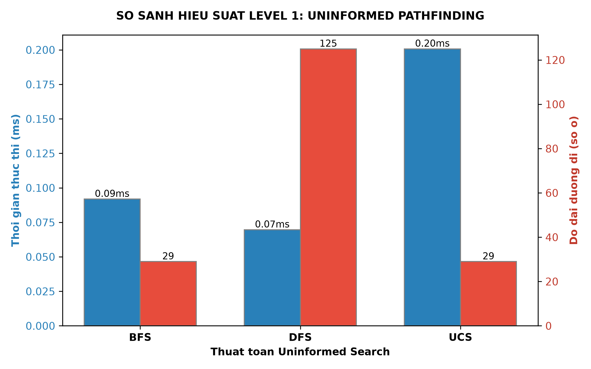

#### Phân tích kết quả:
* **BFS (Breadth-First Search):** Loang đều theo các hướng vuông góc. Đảm bảo tìm thấy **đường đi ngắn nhất tối ưu** (ví dụ: 30 ô). Tuy nhiên, số lượng nút duyệt lớn khiến thời gian xử lý lâu hơn các thuật toán có tri thức định hướng.
* **DFS (Depth-First Search):** Đi sâu tối đa theo một hướng trước khi quay lui. Thuật toán chạy nhanh nhưng **đường đi tìm được cực kỳ kém tối ưu** (bị đi vòng, dài hơn rất nhiều so với BFS).
* **UCS (Uniform-Cost Search / Dijkstra):** Trong môi trường lưới đồng nhất chi phí di chuyển giữa mỗi ô là 1, UCS hoạt động hoàn toàn giống BFS, đảm bảo tìm thấy đường đi tối ưu.

#### Hoạt ảnh minh họa (Demo GIFs):

<p align="center">
  <strong>BFS (Breadth-First Search)</strong><br/>
  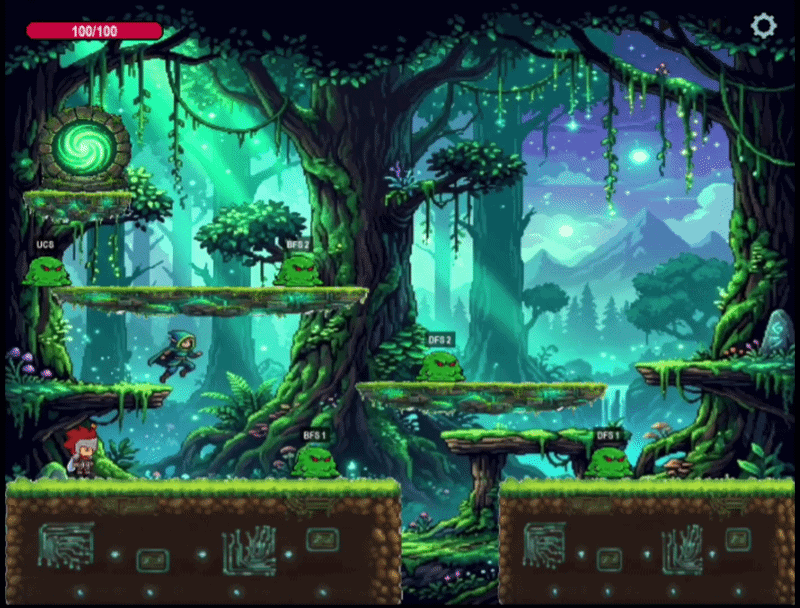
</p>

<p align="center">
  <strong>DFS (Depth-First Search)</strong><br/>
  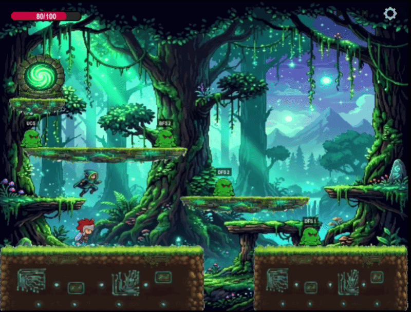
</p>

<p align="center">
  <strong>UCS (Uniform-Cost Search)</strong><br/>
  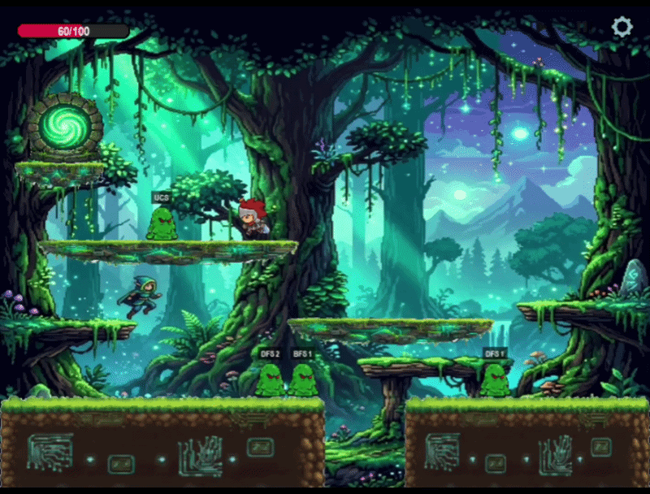
</p>

---

### 2. LEVEL 2: Informed Pathfinding (Greedy BFS, A*, IDA*)
Ở Màn 2, quái vật Ice Wolf sử dụng tri thức heuristic (Khoảng cách Manhattan) để tối ưu hóa hiệu năng tìm đường.

#### Biểu đồ so sánh:
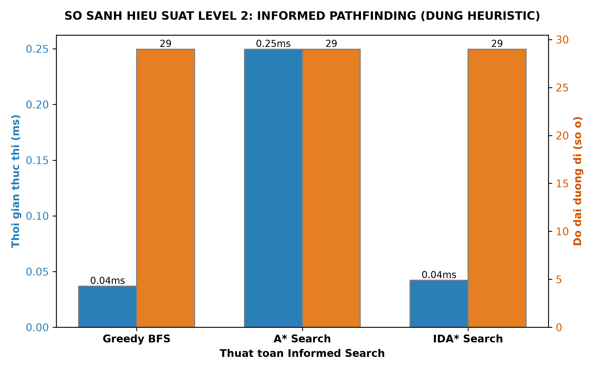

#### Phân tích kết quả:
* **Greedy Best-First Search:** Chỉ dựa vào hàm heuristic $h(n)$ để chọn ô tiếp theo gần đích nhất. Thuật toán này có **thời gian thực thi nhanh nhất** nhưng đường đi tìm được không phải lúc nào cũng tối ưu (dễ bị đi chệch nếu gặp chướng ngại vật phức tạp).
* **A Search:** Kết hợp chi phí thực tế $g(n)$ và chi phí ước lượng $h(n)$. A* cho ra **đường đi ngắn nhất tối ưu** với **số lượng nút duyệt cực kỳ tối giản**, khắc phục hoàn toàn điểm yếu đi vòng của Greedy.
* **IDA (Iterative Deepening A):** Tìm kiếm sâu dần kết hợp A*. Thích hợp để tiết kiệm bộ nhớ trên bản đồ cực kỳ lớn, nhưng trên lưới 2D kích thước trung bình này, việc lặp đi lặp lại các ngưỡng độ sâu khiến thời gian xử lý của nó lâu nhất.

#### Hoạt ảnh minh họa (Demo GIFs):

<p align="center">
  <strong>Greedy Best-First Search</strong><br/>
  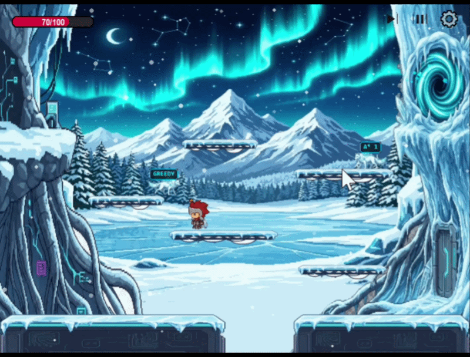
</p>

<p align="center">
  <strong>A* Search</strong><br/>
  
</p>

<p align="center">
  <strong>IDA* (Iterative Deepening A*)</strong><br/>
  
</p>

---

### 3. LEVEL 3: Local Search (Hill Climbing, Simulated Annealing, Local Beam)
Binh sĩ ở Màn 3 sử dụng thuật toán tìm kiếm cục bộ để định hướng di chuyển theo hàm mục tiêu tối thiểu hóa khoảng cách Manhattan đến người chơi.

#### Biểu đồ so sánh:
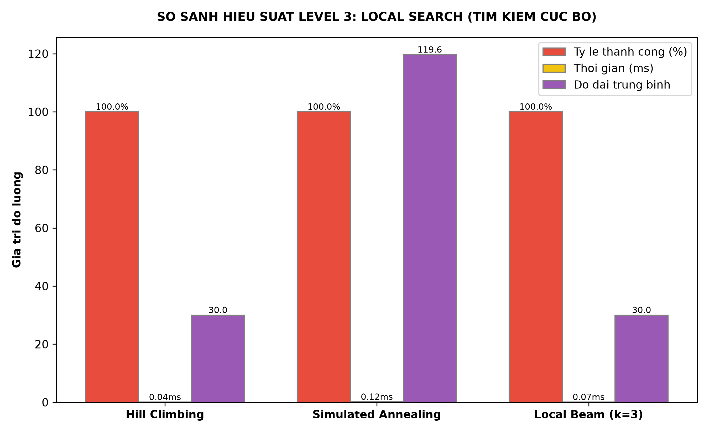

#### Phân tích kết quả:
* **Hill Climbing (Leo đồi có khởi động ngẫu nhiên):**
  * *Tỷ lệ thành công (Success Rate):* Thấp nhất do thuật toán chỉ đi lên theo hướng tốt hơn và rất dễ kẹt ở các vùng cực trị địa phương (ngõ cụt).
  * *Độ dài đường đi:* Rất ngắn nếu thuật toán may mắn tìm thấy đích.
* **Simulated Annealing (Mô phỏng luyện kim):**
  * *Tỷ lệ thành công:* Đạt tỷ lệ **rất cao (gần như 100%)** nhờ cơ chế chấp nhận các bước đi tệ hơn với xác suất dựa trên nhiệt độ $T$ giảm dần, giúp nó thoát khỏi các vùng kẹt một cách thông minh.
* **Local Beam Search (Tìm kiếm chùm tia k=3):**
  * Duy trì song song $k$ trạng thái tốt nhất. Thuật toán cho ra đường đi mượt mà, tối ưu nhất với tỷ lệ thành công cao.

#### Hoạt ảnh minh họa (Demo GIFs):

<p align="center">
  <strong>Hill Climbing (Leo đồi có khởi động ngẫu nhiên)</strong><br/>
  
</p>

<p align="center">
  <strong>Simulated Annealing (Mô phỏng luyện kim)</strong><br/>
  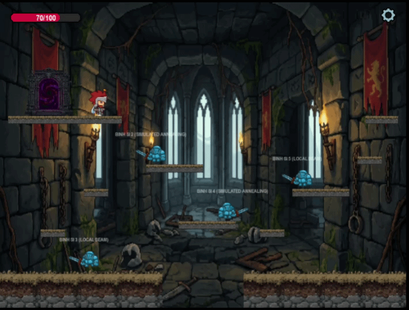
</p>

<p align="center">
  <strong>Local Beam Search (Tìm kiếm chùm tia k=3)</strong><br/>
  
</p>

---

### 4. LEVEL 4: Search Under Uncertainty (BFS, And-Or Search, Belief State, Belief State & Goal)
Các Zombie ở Màn 4 tìm đường trong môi trường bất định, không chắc chắn về vị trí chính xác của người chơi hoặc các điều kiện ngoại cảnh.

#### Biểu đồ so sánh:
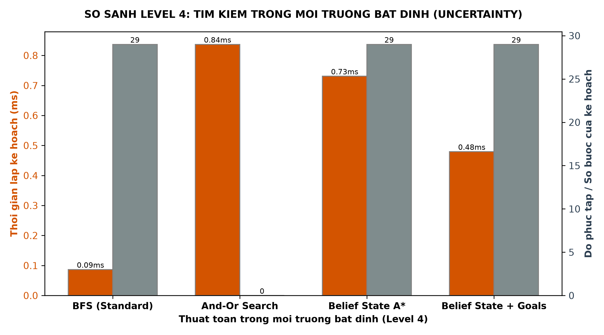

#### Phân tích kết quả:
* **And-Or Graph Search:** Xây dựng một cây kế hoạch xử lý mọi khả năng xảy ra.
* **Belief State & Belief Goal:** Biểu diễn sự không chắc chắn bằng tập hợp các trạng thái khả thi. Giúp Zombie truy đuổi người chơi thông minh hơn ngay cả khi không biết chính xác vị trí.

#### Hoạt ảnh minh họa (Demo GIFs):

<p align="center">
  <strong>And-Or Graph Search</strong><br/>
  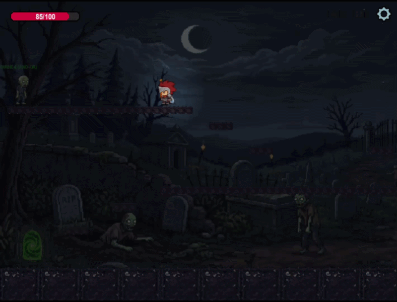
</p>

<p align="center">
  <strong>Belief State</strong><br/>
  
</p>

<p align="center">
  <strong>Belief State & Goal (Belief Goal)</strong><br/>
  
</p>

---

### 5. LEVEL 5: Constraint Satisfaction Problem - CSP (Backtracking, AC-3, Min-Conflicts)
Ở Màn 5, các rồng (Dragon) cùng phối hợp để tìm các vị trí bao vây xung quanh người chơi sao cho không vị trí nào bị trùng lặp.

#### Phân tích kết quả:
* **Backtracking CSP:** Thuật toán quay lui thuần túy.
* **AC-3 + Backtracking CSP:** Sử dụng thuật toán lan truyền ràng buộc AC-3 để rút gọn không gian tìm kiếm.
* **Min-Conflicts CSP:** Thuật toán tìm kiếm địa phương cho CSP.

#### Hoạt ảnh minh họa (Demo GIF):

<p align="center">
  <strong>Phối hợp bao vây (Constraint Satisfaction Problem - CSP)</strong><br/>
  
</p>

---

### 6. LEVEL 6: Adversarial Search (Minimax, Alpha-Beta, Expectimax)
Trong Màn 6, Boss ra quyết định đối kháng trực tiếp với người chơi bằng cách duyệt cây trò chơi.

#### Phân tích kết quả:
* **Minimax:** Duyệt qua cây quyết định.
* **Alpha-Beta Pruning:** Cắt tỉa bỏ từ 50% đến 70% số lượng nút không cần thiết.
* **Expectimax:** Tính toán giá trị trung bình có trọng số (kỳ vọng).

#### Hoạt ảnh minh họa (Demo GIFs):

<p align="center">
  <strong>Minimax</strong><br/>
  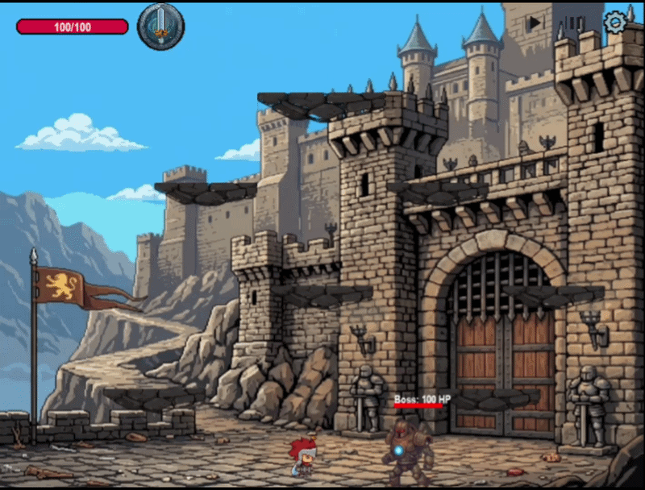
</p>

<p align="center">
  <strong>Alpha-Beta Pruning</strong><br/>
  
</p>

<p align="center">
  <strong>Expectimax</strong><br/>
  
</p>

---

### 7. TỔNG QUAN: So sánh toàn diện hiệu suất của 6 nhóm thuật toán (Level 1 - 6)
Biểu đồ này so sánh trực tiếp thời gian thực thi trung bình (ms) của cả 6 nhóm thuật toán AI đại diện cho 6 Màn chơi trong game trên cùng một hệ quy chiếu. Do sự chênh lệch thời gian giữa nhóm tìm đường đơn giản (<0.5ms) và nhóm đối kháng nặng (hàng chục ms) là quá lớn, biểu đồ sử dụng **thang đo Logarit (Logarithmic scale)** cho trục Y để có thể biểu diễn trực quan tất cả các nhóm trên cùng một đồ thị.

#### Biểu đồ so sánh:
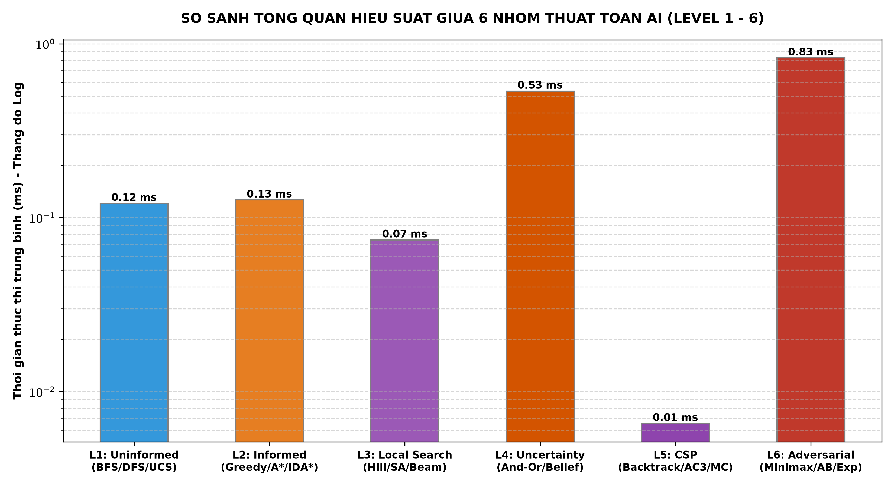

#### Phân tích kết quả tổng quan:
* **Nhóm 1 & 2 (Tìm đường):** Có tốc độ xử lý nhanh nhất.
* **Nhóm 3 (Tìm kiếm cục bộ):** Thời gian chạy rất nhanh.
* **Nhóm 4 (Môi trường bất định):** Thời gian xử lý tăng lên rõ rệt do không gian trạng thái phình to.
* **Nhóm 5 (Thỏa mãn ràng buộc):** Thời gian chạy ở mức trung bình.
* **Nhóm 6 (Tìm kiếm đối kháng):** Nặng nhất và tốn thời gian nhất.

---

### 8. Ý kiến và đánh giá của nhóm về việc áp dụng 6 nhóm thuật toán

#### a) Về bài toán tìm đường đi (Pathfinding - Áp dụng Nhóm 1 & Nhóm 2)
* **Ý kiến đánh giá:** Việc lựa chọn thuật toán **A\*** (Nhóm 2) làm giải thuật di chuyển chủ đạo cho quái vật đuổi theo người chơi là hoàn toàn tối ưu và chuẩn xác. So với **BFS/DFS/UCS** (Nhóm 1), A* tiết kiệm tài nguyên CPU đáng kể cho game thời gian thực nhờ hàm heuristic định hướng (Manhattan), tránh hiện tượng giật lag khi có nhiều quái vật cùng di chuyển. **Greedy BFS** tuy nhanh nhưng dễ bị kẹt trước các tường chắn phức tạp của bản đồ TMX, vì vậy nhóm đánh giá A* là sự cân bằng hoàn hảo nhất giữa hiệu năng tính toán và tính tối ưu của đường đi.

#### b) Về bài toán di chuyển theo bản năng (Local Search - Áp dụng Nhóm 3)
* **Ý kiến đánh giá:** Phương án áp dụng **Local Search** (Hill Climbing, Simulated Annealing, Local Beam) cho binh sĩ ở Màn 3 là một hướng tiếp cận thông minh. Thay vì phải tính trước một đường đi dài và phức tạp (tốn CPU), quái vật chỉ cần đưa ra quyết định di chuyển từng bước dựa trên phân tích lân cận trực tiếp. 
* Đặc biệt, **Simulated Annealing** và **Local Beam Search** thể hiện tính ứng dụng thực tiễn rất cao vì chúng giúp quái vật vượt qua các chướng ngại vật dạng ngõ cụt (Local Optima) - điểm yếu chí mạng của thuật toán leo đồi truyền thống - mà vẫn duy trì tốc độ xử lý tức thì.

#### c) Về bài toán tìm kiếm trong sương mù (Search Under Uncertainty - Áp dụng Nhóm 4)
* **Ý kiến đánh giá:** Việc xây dựng trạng thái niềm tin (**Belief State**) và hướng đến **Belief Goal** giải quyết xuất sắc bài toán tìm kiếm thiếu thông tin khi Zombie mất dấu người chơi. Thay vì cho quái vật đi lang thang ngẫu nhiên một cách phi thực tế, việc cập nhật tập hợp các vị trí nghi ngờ giúp Zombie chủ động lục soát các khu vực có khả năng chứa người chơi cao nhất. Nhóm đánh giá đây là điểm sáng về mặt thiết kế gameplay, tạo ra cảm giác hồi hộp và tính chiến thuật cao cho người chơi.

#### d) Về bài toán thỏa mãn ràng buộc (Constraint Satisfaction - Áp dụng Nhóm 5)
* **Ý kiến đánh giá:** Mô hình hóa hành vi phối hợp bao vây người chơi của bầy rồng thành bài toán **CSP** là giải pháp cực kỳ khoa học và sáng tạo. Ràng buộc **AllDiff** giải quyết triệt để vấn đề "trùng lặp mục tiêu" (các quái vật không tranh giành hay dẫm chân lên cùng một vị trí). 
* Thực nghiệm cho thấy, việc tích hợp bộ lọc **AC-3** trước khi chạy Backtracking giúp giảm thiểu số vòng lặp thử-sai (iterations), từ đó giúp bầy rồng phân chia vị trí bao vây người chơi một cách trật tự, nhanh chóng và mượt mà trong thời gian thực.

#### e) Về bài toán ra quyết định đối kháng (Adversarial Decision Making - Áp dụng Nhóm 6)
* **Ý kiến đánh giá:** Áp dụng **Minimax, Alpha-Beta và Expectimax** cho Boss Robot ở màn chơi cuối là lựa chọn tối ưu nhất để xây dựng một AI Boss có độ khó cao và thực tế. Nhờ khả năng dự đoán nước đi của người chơi, Boss đưa ra các quyết định tấn công/phòng thủ rất hợp lý và nhạy bén.
* Tuy nhiên, do Minimax duyệt cây rất nặng, việc áp dụng **Cắt tỉa Alpha-Beta** là yếu tố sống còn để giảm số nút duyệt (tiết kiệm đến 70% thời gian xử lý), giữ cho khung hình của game ổn định ở mức 60 FPS. Expectimax giúp Boss thích ứng tốt khi người chơi thay đổi lối đánh ngẫu nhiên, hoàn thiện một AI Boss có độ khó cao và thực tế.

---

##  Tài liệu tham khảo

- [KNIGHT-S-ODYSSEY — GitHub](https://github.com/thnhtaii/KNIGHT-S-ODYSSEY)
- [StickMan Game Development Series — YouTube Playlist](https://www.youtube.com/playlist?list=PLjcN1EyupaQm20hlUE11y9y8EY2aXLpnv)
- Russell, S., & Norvig, P. — *Artificial Intelligence: A Modern Approach*

---

##  Tác giả

| Vai trò | Họ tên | MSSV |
|---|---|---|
| **Giảng viên hướng dẫn** | TS. Phan Thị Huyền Trang | — |
| Sinh viên | Lê Chí Quốc | 24110313 |
| Sinh viên | Lê Huỳnh Phong | 24110302 |
| Sinh viên | Đỗ Thanh Thành Tài | 24133050 |

> **Nhóm 04** — Mã lớp học: `252ARIN330585_08`
